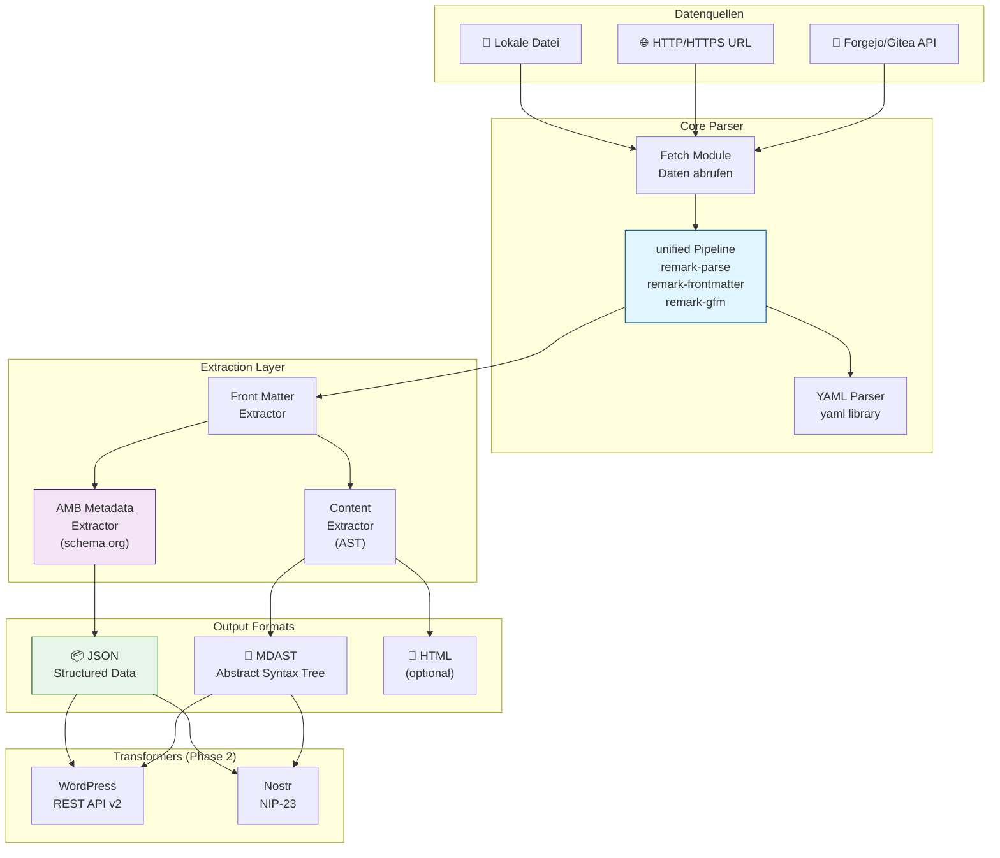
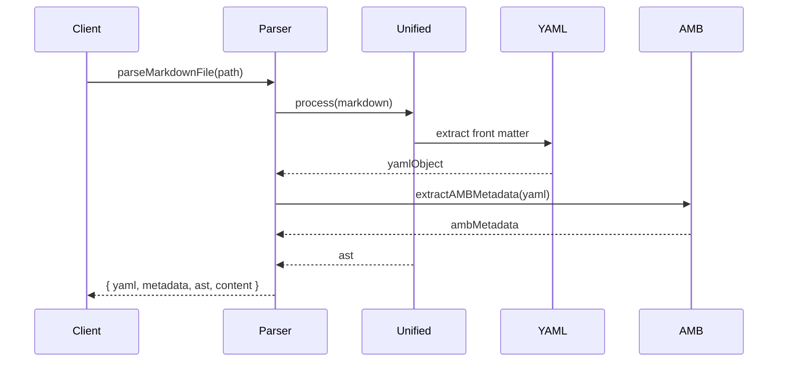
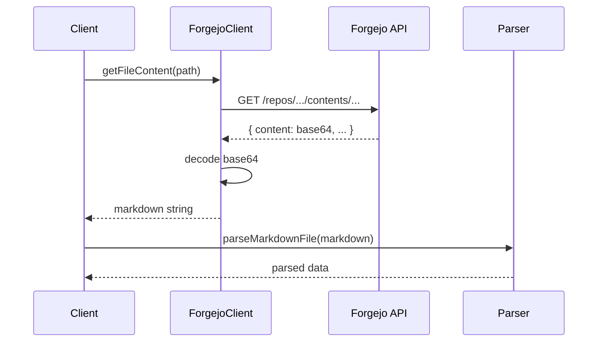
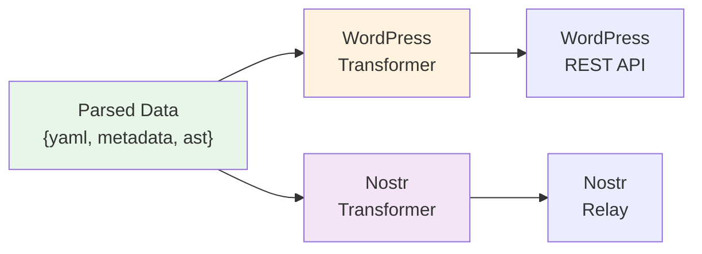

# 🏛️ Architektur-Dokumentation

## Überblick

MDParser ist ein modularer, erweiterbarer Parser für Markdown-Dateien mit YAML Front Matter, optimiert für die Verarbeitung von AMB-konformen Bildungsressourcen.

## 📐 Architektur-Diagramm



## 🎯 Design-Prinzipien

### 1. **Modularität**
- Jede Komponente hat eine klare Verantwortung
- Lose Kopplung zwischen Modulen
- Einfach erweiterbar durch Plugin-System

### 2. **Isomorphie**
- Code funktioniert in Node.js **und** Browser
- Keine Node.js-spezifischen APIs im Core
- Native `fetch` für HTTP-Requests

### 3. **Standards-Konformität**
- AMB-Metadatenstandard (schema.org)
- MDAST (Markdown Abstract Syntax Tree)
- CommonMark + GFM (GitHub Flavored Markdown)

### 4. **Fehlertoleranz**
- Graceful Degradation bei fehlenden Metadaten
- Validierung mit aussagekräftigen Fehlermeldungen
- Optionale Felder werden sauber behandelt

## 📦 Modul-Struktur

### Core Module

#### 1. **Parser (`src/parser.js`)**
```javascript
export async function parseMarkdownFile(filePath, options) {
  // Haupteinstiegspunkt für Markdown-Parsing
  // Orchestriert unified Pipeline
  return {
    yaml: {},      // Rohes YAML Front Matter
    metadata: {},  // Extrahierte AMB-Metadaten
    ast: {},       // Markdown AST
    content: "",   // Reiner Content
    html: ""       // Optional: HTML-Output
  }
}
```

**Technologie:** unified + remark Ökosystem

**Plugins:**
- `remark-parse` - Markdown → AST
- `remark-frontmatter` - YAML Front Matter Support
- `remark-gfm` - GitHub Flavored Markdown
- `remark-stringify` - AST → Markdown (optional)
- `remark-html` - AST → HTML (optional)

#### 2. **Forgejo Client (`src/forgejo-client.js`)**
```javascript
export class ForgejoClient {
  constructor(config) { /* ... */ }
  
  async getFileContent(path) { /* ... */ }
  async listDirectory(path) { /* ... */ }
  async listPosts(postsDir) { /* ... */ }
  async getRepository() { /* ... */ }
}
```

**API-Endpoints:**
- `/repos/{owner}/{repo}/contents/{path}` - Dateiinhalt
- `/repos/{owner}/{repo}/git/trees/{sha}` - Verzeichnis-Listing
- Content wird Base64-dekodiert

#### 3. **YAML Extractor (`src/extractors/yaml-extractor.js`)**
```javascript
export function extractYAML(markdownContent) {
  // Extrahiert YAML Front Matter
  // Parst mit yaml library
  return yamlObject
}
```

**Technologie:** `yaml` library (v2.x)

**Features:**
- Komplexe YAML-Strukturen
- Arrays, nested Objects
- Multi-line Strings
- Datum-Parsing

#### 4. **AMB Metadata Extractor (`src/extractors/amb-extractor.js`)**
```javascript
export function extractAMBMetadata(yamlObject) {
  // Transformiert YAML → Schema.org
  // Validiert AMB-Konformität
  return ambMetadata
}
```

**Mapping:**
```javascript
{
  "@context": "https://schema.org/",
  "type": "LearningResource",
  "name": yaml.commonMetadata.name,
  "description": yaml.commonMetadata.description,
  "creator": mapCreators(yaml.commonMetadata.creator),
  "license": yaml.commonMetadata.license,
  "inLanguage": yaml.commonMetadata.inLanguage,
  "datePublished": yaml.commonMetadata.datePublished,
  "about": yaml.commonMetadata.about,
  "image": yaml.commonMetadata.image,
  "id": yaml.commonMetadata.id,
  "learningResourceType": yaml.commonMetadata.learningResourceType,
  "educationalLevel": yaml.commonMetadata.educationalLevel
}
```

### Transformation Layer (Phase 2)

#### 5. **WordPress Transformer (`src/transformers/wordpress.js`)**
```javascript
export function transformToWordPress(parsedData) {
  return {
    title: "",
    content: "",
    excerpt: "",
    featured_media: 0,
    tags: [],
    categories: [],
    meta: {},
    author: 0
  }
}
```

**WordPress REST API v2 Format**

#### 6. **Nostr Transformer (`src/transformers/nostr.js`)**
```javascript
export function transformToNostr(parsedData) {
  return {
    kind: 30023,  // NIP-23 Long-form
    tags: [
      ["d", ""],          // unique identifier
      ["title", ""],
      ["summary", ""],
      ["published_at", ""],
      ["image", ""],
      ["t", ""],          // hashtags
      ["e", ""],          // event refs
      ["a", ""],          // article refs
      ["p", ""]           // pubkey refs
    ],
    content: ""  // Markdown content
  }
}
```

## 🔄 Datenfluss

### 1. Parsing-Pipeline



### 2. Forgejo API Integration



### 3. Transformation (Phase 2)



## 🛠️ Technologie-Entscheidungen

### Warum unified/remark?

| Alternative | Pro | Contra | Entscheidung |
|-------------|-----|--------|--------------|
| **marked** | ✅ Sehr populär<br/>✅ Einfach | ❌ HTML-fokussiert<br/>❌ Kein AST | ❌ Abgelehnt |
| **markdown-it** | ✅ Erweiterbar<br/>✅ Performance | ❌ Komplexe API<br/>❌ HTML-fokussiert | ❌ Abgelehnt |
| **unified/remark** | ✅ AST-basiert<br/>✅ Isomorph<br/>✅ Plugin-System<br/>✅ Standard | ⚠️ Lernkurve | ✅ **GEWÄHLT** |
| **gray-matter + marked** | ✅ Einfach | ❌ Weniger strukturiert | ⚠️ Fallback |

### Warum `yaml` library?

| Alternative | Pro | Contra | Entscheidung |
|-------------|-----|--------|--------------|
| **js-yaml** | ✅ Populär | ❌ Größere Bundle-Size | ❌ Abgelehnt |
| **yaml** | ✅ Modern<br/>✅ Spec-compliant<br/>✅ Klein | - | ✅ **GEWÄHLT** |
| JSON.parse | ✅ Native | ❌ Kein YAML-Support | ❌ Nicht geeignet |

### Warum native `fetch`?

- ✅ Standard in Node.js 18+
- ✅ Identische API im Browser
- ✅ Keine Dependencies
- ✅ Async/await Support

## 📊 Performance-Überlegungen

### Caching-Strategie

```javascript
// Optional: Cache für häufig abgerufene Dateien
const cache = new Map()

async function parseWithCache(path, options) {
  const cacheKey = `${path}-${JSON.stringify(options)}`
  
  if (cache.has(cacheKey)) {
    return cache.get(cacheKey)
  }
  
  const result = await parseMarkdownFile(path, options)
  cache.set(cacheKey, result)
  
  return result
}
```

### Rate Limiting für APIs

```javascript
// Forgejo API: Max. 10 Requests/Sekunde
const rateLimiter = new RateLimiter({
  tokensPerInterval: 10,
  interval: 1000
})
```

## 🔒 Sicherheit

### Input-Validierung

- YAML-Bombing-Schutz (max. depth/size)
- Path-Traversal-Schutz bei Dateizugriffen
- Content-Type-Validierung bei API-Requests

### Sanitization

- XSS-Schutz bei HTML-Output (optional mit DOMPurify)
- SQL-Injection-Schutz bei DB-Integration (Phase 2)

## 🧪 Testing-Strategie

### Unit Tests
```
test/
├── parser.test.js
├── yaml-extractor.test.js
├── amb-extractor.test.js
├── forgejo-client.test.js
└── transformers/
    ├── wordpress.test.js
    └── nostr.test.js
```

### Integration Tests
- End-to-End mit echtem Forgejo-Repository
- Mocking der API-Responses

### Test-Fixtures
```
test/fixtures/
├── valid-amb.md
├── missing-metadata.md
├── complex-yaml.md
└── github-flavored.md
```

## 🚀 Deployment-Szenarien

### 1. **Node.js CLI**
```bash
npm install -g mdparser
mdparser parse ./content/post.md
```

### 2. **Node.js Library**
```javascript
import { parseMarkdownFile } from 'mdparser'
const result = await parseMarkdownFile('./post.md')
```

### 3. **Browser (ESM)**
```html
<script type="module">
  import { parseMarkdownFile } from './mdparser.js'
  // ...
</script>
```

### 4. **Serverless Function**
```javascript
// Vercel/Netlify Function
export default async function handler(req, res) {
  const result = await parseMarkdownFile(req.body.url)
  res.json(result)
}
```

## 📈 Roadmap & Erweiterungen

### Phase 1: Core Parser ✅ (aktuell)
- [x] Projekt-Setup
- [ ] Parser-Implementierung
- [ ] Forgejo-Client
- [ ] AMB-Extraktor
- [ ] Tests & Dokumentation

### Phase 2: Transformers 🚧
- [ ] WordPress-Integration
- [ ] Nostr-Integration
- [ ] Batch-Processing

### Phase 3: Advanced Features 🔮
- [ ] Browser-Build
- [ ] CLI-Tool
- [ ] Webhook-Support
- [ ] Real-time Sync
- [ ] GraphQL-API

## 🤝 Contribution Guidelines

Siehe [CONTRIBUTING.md](../CONTRIBUTING.md) für Details zu:
- Code-Style (ESLint + Prettier)
- Commit-Conventions
- Pull-Request-Prozess
- Testing-Requirements
