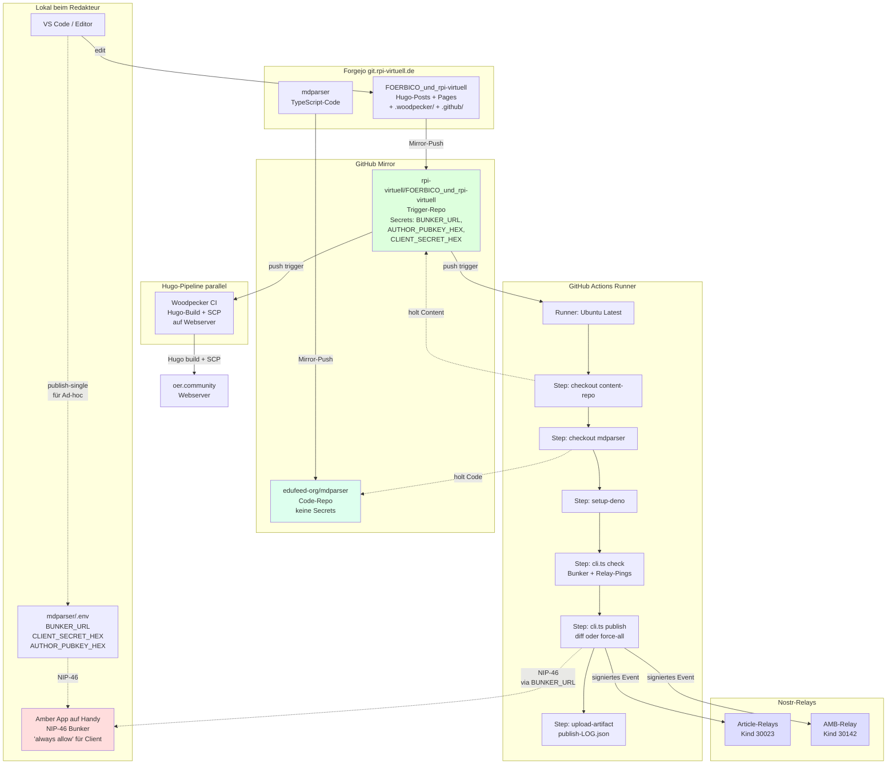
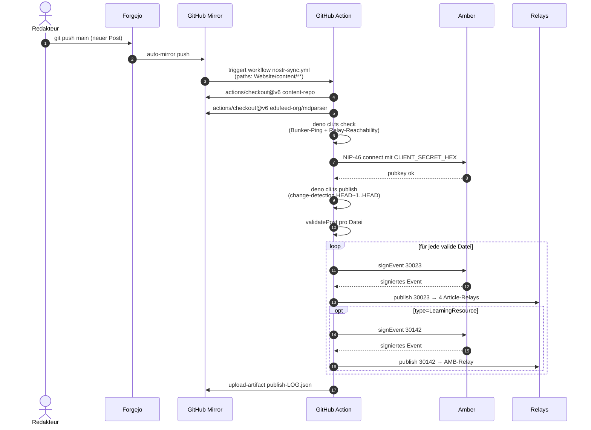
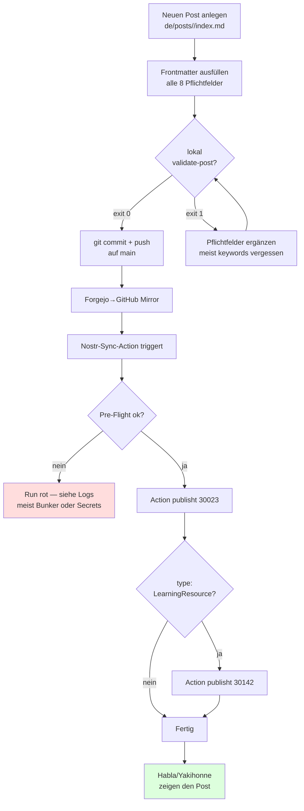

# Setup-Guide: mdparser-Sync mit GitHub-Action

> Stand 2026-09-02. Beschreibt die Phase-1-Live-Pipeline und die Stolperfallen, die beim Aufsetzen aufgetaucht sind.

## Was du am Ende hast

Bei jedem `git push` auf `main` im Content-Repo (FOERBICO) mit Änderungen unter `Website/content/**` läuft automatisch ein GitHub-Workflow, der:

1. Geänderte Posts/Pages im Repo findet (Diff seit letztem Push)
2. Die sieben Pflichtfelder validiert (`keywords` ist empfohlen, kein Pflichtfeld)
3. Vollständige Posts via Amber/NIP-46 signiert
4. Als Kind 30023 (Long-form Article) an 4 Relays publisht
5. Bei `type: LearningResource` zusätzlich Kind 30142 (AMB-Metadaten) ans AMB-Relay sendet
6. Posts mit fehlenden Pflichtfeldern überspringt (kein Abbruch)
7. Eine Job-Summary schreibt: was publiziert wurde, was nicht und warum
8. JSON-Log als Artifact hochlädt

## Architektur



### Repo-Rollen

| Repo | Rolle | Was liegt drin |
|---|---|---|
| `mdparser` | **Code-Library** | TypeScript: parser, signer, relays, change-detection, validation, cli.ts. Keine Secrets. |
| `FOERBICO_und_rpi-virtuell` | **Content + Trigger** | Hugo-Posts, `.github/workflows/nostr-sync.yml`, `.woodpecker/build_and_copy_website.yaml`. |

Beide existieren auf Forgejo (Source of Truth) und werden automatisch zu GitHub gemirrort. Die GitHub-Action zieht zur Laufzeit beides per `actions/checkout@v6` in den Runner.

## Trigger-Mechanik im Detail



## Setup von Null

### 1. mdparser-Repo auf Forgejo + GitHub-Mirror

Forgejo: `git.rpi-virtuell.de/Comenius-Institut/mdparser`
GitHub-Mirror: `github.com/edufeed-org/mdparser`

Forgejo→GitHub-Mirror per Push-Mirror eingerichtet. Mirror synct **alle Branches** automatisch.

### 2. FOERBICO-Repo auf Forgejo + GitHub-Mirror

Forgejo: `git.rpi-virtuell.de/Comenius-Institut/FOERBICO_und_rpi-virtuell`
GitHub-Mirror: `github.com/rpi-virtuell/FOERBICO_und_rpi-virtuell`

### 3. Workflow-Datei in FOERBICO-Repo

Die Datei `.github/workflows/nostr-sync.yml` liegt **im FOERBICO-Repo**, nicht im mdparser-Repo.

> **Wichtige Hürde:** GitHub zeigt einen Workflow im UI nur an, wenn die YAML auf dem **Default-Branch** (= `main`) liegt. Wenn du auf einem Test-Branch arbeitest, **musst du die Workflow-Datei via Cherry-Pick auch nach `main` bringen**, sonst gibt's keinen "Run workflow"-Button. Der Run kann dann trotzdem mit Branch-Auswahl auf jedem Branch ausgeführt werden — nur sichtbar wird er nur, wenn die Datei auf `main` liegt.

### 4. GitHub-Secrets im FOERBICO-Mirror

Unter https://github.com/rpi-virtuell/FOERBICO_und_rpi-virtuell/settings/secrets/actions drei Repository-Secrets anlegen:

| Name | Wert | Quelle |
|---|---|---|
| `BUNKER_URL` | `bunker://...?relay=...&secret=...` | Aus `mdparser/.env`, exakt wie lokal |
| `AUTHOR_PUBKEY_HEX` | 64 lowercase hex | FOERBICO-Pubkey |
| `CLIENT_SECRET_HEX` | 64 lowercase hex | Identisch zu lokal in `mdparser/.env` |

> **Hürde 1 (Whitespace):** Beim Pasten ins GitHub-UI können führende/abschließende Leerzeichen mit reinkommen. Unser Validator rejected solche Werte mit `AUTHOR_PUBKEY_HEX muss 64 lowercase hex sein, ist:  5a12b41…` (zwei Leerzeichen vor dem Wert). **Tipp:** Triple-Click im Quell-Markdown markiert die ganze Zeile inkl. Anfang/Ende sauber.

> **Hürde 2 (Client-Secret):** Der Plan sah einen separaten CI-Client-Secret vor. In der Praxis hat das Probleme gemacht (Amber sieht "neuen Client", lehnt mit `no permission` ab, neuer Pairing-Push kommt manchmal nicht durch). **Pragmatisch besser:** Lokal und CI nutzen denselben `CLIENT_SECRET_HEX`. Damit ist die App-Identität in Amber für beide Quellen gleich, Approval gilt für beide.

> **Hürde 3 (Always-Allow):** Wenn Amber dich beim ersten Sign-Request anpiept, antippe **"Always allow"**. Das verhindert, dass jeder einzelne Post-Publish einen Approval-Tap auf dem Handy braucht.

### 5. Lokale `mdparser/.env`

```env
BUNKER_URL=bunker://2b964d32...?relay=wss://relay.primal.net/&relay=wss://theforest.nostr1.com/&relay=wss://relay.edufeed.org/&secret=c05ca983-...
CLIENT_SECRET_HEX=ca2d1ead45d6baa6...
AUTHOR_PUBKEY_HEX=5a12b41ec15b466321e88c371be2dc47d9193f9c8bba4ab09fc50045bd35aedf
```

> **Hürde 4 (Bunker-Pairing):** Wenn `signer: getPublicKey…` lange läuft und ohne erkennbaren Amber-Push timeoutet, ist das Pairing alt/kaputt. In Amber den App-Eintrag löschen, neuen `bunker://`-URL erzeugen, in `.env` einsetzen, ersten Sign-Request mit "Always allow" bestätigen. **Den `CLIENT_SECRET_HEX` aber NICHT neu generieren** — nur die `BUNKER_URL` ändert sich.

### 6. Amber-Setup

1. Amber installiert auf dem Handy.
2. FOERBICO-Account in Amber: nsec rein, Account-Eintrag mit pubkey `5a12b41e…`.
3. Beim ersten lokalen `publish-single` und beim ersten CI-Run kommt jeweils ein App-Approval-Push:
   - **Lokal:** App-ID basiert auf lokalem CLIENT_SECRET_HEX → "Always allow" tippen
   - **CI:** Wenn beide Secrets gleich sind, taucht das gleiche App-Eintrag-Icon auf, kein erneuter Approval nötig

## Frontmatter-Pflichtfelder

Damit ein Post als `ok` klassifiziert und publiziert wird, müssen die **sieben Pflichtfelder** im `commonMetadata`-Block gesetzt sein. `keywords` ist seit 2026-09-02 **empfohlen, nicht Pflicht**: fehlt es, wird der Post trotzdem publiziert und in der Job-Summary unter „Metadaten unvollständig" gelistet.

```yaml
---
# commonMetadata
'@context': https://schema.org/
creativeWorkStatus: Published
type: LearningResource     # oder BlogPosting o.ä.
name: <Titel>
description: <Kurz-Beschreibung>
license: https://creativecommons.org/licenses/by/4.0/
id: https://oer.community/<slug>      # MUSS mit https://oer.community/ beginnen
creator:
  - givenName: ...
    familyName: ...
inLanguage:
  - de
datePublished: 2026-01-01
keywords:                  # empfohlen, kein Pflichtfeld
  - schlagwort1
  - schlagwort2
---
```

Fehlt eines der **sieben Pflichtfelder** (`id`, `name`, `description`, `license`, `creator`, `inLanguage`, `datePublished`), wird der Post mit `skip-missing-fields` übersprungen — **kein Abbruch der Pipeline**, der Post wird einfach nicht als Nostr-Event publiziert.

> **Warum keywords gelockert wurde (2026-09-02):** 74 von 93 Content-Dateien hatten kein `keywords`. Der Pflichtfeld-Check hat damit den Großteil des Archivs blockiert — im Lauf vom 01.09. waren 39 der 43 Skips allein darauf zurückzuführen. Nach der Lockerung sind 78 statt 18 Dateien publizierbar. Die fachliche Lücke bleibt sichtbar, sie blockiert nur nicht mehr.

> **Hürde 5 (`d`-Tag-Stabilität):** Der `d`-Tag eines Nostr-Events wird aus `commonMetadata.id` (letztes Pfad-Segment der URL) abgeleitet. Beispiel `id: https://oer.community/recap-foerbico-tagung-2026` → `d=recap-foerbico-tagung-2026`. **Diesen Wert nach dem ersten Publish nie ändern**, sonst sieht Habla/Yakihonne den Post als komplett neu, und die alten Kommentare/Likes hängen an einem nicht mehr gefundenen Event.

## Was ein Run meldet

Seit 2026-09-02 schreibt jeder Run eine **Job-Summary** (sichtbar direkt auf der Run-Seite in GitHub, ohne das Log zu öffnen):

- Zähler publiziert / übersprungen / fehlgeschlagen
- Liste der nicht publizierten Dateien **mit Grund**
- Posts, die publiziert wurden, denen aber empfohlene Felder fehlen
- Relays, die Events nicht bestätigt haben

> **⚠️ Stiller Fehlschlag:** Wurden Dateien geändert, aber **kein einziger** Post publiziert, steht ganz oben eine Warnung. Dieser Fall — Redaktion pusht, Action ist grün, auf Nostr kommt nichts an — lief bis September 2026 unbemerkt durch (Runs vom 13.08., 17.08., 27.08. mit je `ok=0 skipped=1`). Der Exit-Code bleibt bewusst 0, damit die Pipeline nicht dauerrot ist; die Sichtbarkeit läuft über die Summary.

## Lokale Validierung vor Push

```bash
cd ~/repositories/mdparser/sync
deno task validate-post ~/repositories/FOERBICO_und_rpi-virtuell/Website/content/de/posts/<slug>/index.md
```

Exit-Codes:
- `0` → wird publiziert (alles ok)
- `1` → wird geskipt (mit Begründung im Output) oder error
- `2` → File nicht gefunden

## Workflow im Alltag



## Stolperfallen-Quick-Reference

| Symptom | Ursache | Fix |
|---|---|---|
| GitHub-UI zeigt "Nostr Sync"-Workflow nicht | YAML nicht auf Default-Branch | Cherry-pick `.github/workflows/nostr-sync.yml` nach `main` |
| Pre-Flight-Step `AUTHOR_PUBKEY_HEX muss 64 lowercase hex sein` | Whitespace im Secret | Secret editieren, Wert per Triple-Click neu setzen |
| Pre-Flight-Step `Bunker connect failed: no permission` | CI-Client unbekannt in Amber | Lokalen `CLIENT_SECRET_HEX` als CI-Secret nutzen ODER neuen Approval-Push in Amber bestätigen |
| `signer: getPublicKey…` timeoutet ohne Amber-Push | altes Bunker-Pairing kaputt | `bunker://`-URL in Amber löschen + neu erzeugen, `BUNKER_URL` updaten |
| Pre-Flight-Step `Bunker connect failed: Bunker connect timeout` (Relays alle ✅) | Amber-Pairing tot oder Amber offline — tritt dann auch lokal auf | Erst Amber öffnen + Relays prüfen; hilft das nicht: Re-Pairing nach Hürde 4, dann `BUNKER_URL` in `.env` **und** als GitHub-Secret aktualisieren (`gh secret set BUNKER_URL -R rpi-virtuell/FOERBICO_und_rpi-virtuell`). Während des Ausfalls gemergte Posts per `--post <slug>` nachpublizieren |
| Posts werden mit `skip-missing-fields` ignoriert | Pflichtfeld fehlt (oft `keywords`) | Frontmatter ergänzen, neuer Push |
| `change-detection: from-ref ist null-SHA` | Erster Push auf Branch oder `workflow_dispatch` ohne push-Kontext | Empty-Run-Fix greift automatisch (exit 0, 0 Posts) |
| Run grün, aber Post nicht auf Habla | Post wurde übersprungen (Pflichtfeld fehlt) | Job-Summary des Runs öffnen — Abschnitt „Nicht publiziert" nennt die Datei und den Grund |
| Summary meldet Relay ohne Bestätigung | Relay down, überlastet oder lehnt den Autor ab | Ein einzelnes stummes Relay ist unkritisch solange `MIN_RELAY_ACKS` erfüllt ist; dauerhaft stumm → aus `core/relays.ts` entfernen |
| Habla zeigt alte Version statt aktueller | `d`-Tag ist gleich, aber Relays haben veraltete Kopie | `--force-all` oder Re-Publish einzeln |
| GitHub-Action triggert nicht bei Push | `paths: Website/content/**` matcht nicht | Wenn `.github/` oder `.woodpecker/` allein geändert: kein Trigger ist erwartetes Verhalten |

## Manuelles Re-Publish einzelner Posts

```bash
cd ~/repositories/mdparser/sync
CONTENT_ROOT=~/repositories/FOERBICO_und_rpi-virtuell/Website/content \
  deno task publish --post 2026-03-02-FOERBICO-Zwischenfazit-Tagung
```

Funktioniert auch bei Posts, die noch nie publiziert wurden, oder wenn die Action-Variante einen Post übersprungen hat.

**Backfill nach fehlgeschlagenen Runs:** Ein `workflow_dispatch` ohne `force_all` publiziert nichts (diff-Modus ohne Push-Kontext = Empty-Run). Pushes, deren Sync-Run fehlgeschlagen ist, werden also nicht automatisch nachgeholt — die betroffenen Posts einzeln per `--post <ordnername>` publizieren (vorher mit `--dry-run` prüfen). Welche Posts fehlen, zeigt ein Vergleich von `git log origin/main --since=<letzter grüner Run> -- Website/content` mit den `d`-Tags der Kind-30023-Events auf den Relays.

## Incident-Log

- **2026-08 (rückwirkend erkannt am 2026-09-02):** Die Runs vom 13.08., 17.08. und 27.08. waren grün, haben aber je `ok=0 skipped=1` — es wurde nichts publiziert, ohne dass es auffiel. Ursache: fehlende Pflichtfelder in den betroffenen Dateien, kombiniert mit fehlender Sichtbarkeit (Exit-Code 0, keine Job-Summary). Fix: Job-Summary mit Warnung bei stillen Fehlschlägen, `keywords` von Pflicht auf empfohlen gelockert.
- **2026-06-02 bis 2026-06-11:** Alle Sync-Runs rot, Pre-Flight mit `Bunker connect timeout` bei erreichbaren Relays. Ursache: Amber-Pairing (Remote-Pubkey `2b964d32…`) antwortete nicht mehr; mdparser-Code und Secrets unverändert. Fix: Re-Pairing in Amber (neuer Remote-Pubkey `91fb4b51…`, `CLIENT_SECRET_HEX` unverändert), `BUNKER_URL` in `.env` + GitHub-Secret aktualisiert. Verpassten Post `2026-05-18-HackathOERn-2026` per `--post` nachpubliziert (30023: 3/4 Acks, 30142: 1/1).

## Manueller Force-All über die GitHub-Action

Im GitHub-UI:

1. https://github.com/rpi-virtuell/FOERBICO_und_rpi-virtuell/actions/workflows/nostr-sync.yml
2. **"Run workflow ▾"** klicken
3. Branch wählen (`main`), `force_all = true`
4. Run startet, durchläuft alle ContentFiles, publisht alle, die `validatePost.status === 'ok'` haben

## Was die Pipeline NICHT tut

- **Keine Bilder hochladen.** Bilder bleiben unter `oer.community/...` URLs, ihre Auslieferung läuft über die statische Hugo-Site (Woodpecker). Blossom-Upload wäre Phase 2.
- **Keine Relay-Liste pflegen.** Relays sind hardcoded in `core/relays.ts` (`ARTICLE_RELAYS`, `AMB_RELAYS`). Wenn ein Relay umzieht, Code-Änderung im mdparser nötig.
- **Keine Kommentar-Synchronisation.** Habla/Yakihonne zeigen Kommentare als Replies, die über die Standard-Nostr-Mechanik laufen. Sync hat damit nichts zu tun.

## Dateien-Karte

```
mdparser/                                                  # Code-Repo
├── sync/
│   ├── cli.ts                          # Subcommand-Dispatcher
│   ├── publish-single.ts               # Phase-0-Tool für Ad-hoc-Publish
│   ├── core/
│   │   ├── config.ts                   # Env-Reader + Validierung
│   │   ├── parser.ts                   # YAML-Frontmatter
│   │   ├── signer.ts                   # NIP-46 Bunker
│   │   ├── relays.ts                   # ARTICLE_RELAYS + AMB_RELAYS
│   │   ├── change-detection.ts         # git-diff
│   │   ├── discover.ts                 # alle Posts/Pages
│   │   ├── validation.ts               # Pflichtfeld-Check
│   │   └── log.ts                      # JSON-Run-Logger
│   ├── events/
│   │   ├── article.ts                  # Kind 30023 Builder
│   │   └── amb.ts                      # Kind 30142 Builder
│   ├── subcommands/
│   │   ├── check.ts                    # Pre-Flight
│   │   ├── publish.ts                  # processPost + Modi
│   │   └── validate-post.ts            # lokale Datei prüfen
│   └── logs/                           # Run-Artifacts (JSON)

FOERBICO_und_rpi-virtuell/                                # Content + Trigger
├── Website/
│   └── content/
│       ├── de/
│       │   ├── _index.md               # Homepage (Section-Index)
│       │   ├── posts/<slug>/index.md   # Blog-Posts
│       │   └── <page>/index.md         # Seiten (Impressum, etc.)
│       └── en/
│           ├── _index.md               # Homepage en
│           ├── posts/<slug>/index.md
│           └── <page>/index.md
├── .github/
│   └── workflows/
│       └── nostr-sync.yml              # GitHub-Action (85 Zeilen)
└── .woodpecker/
    └── build_and_copy_website.yaml     # Hugo-Build + SCP (parallel)
```

## Stand

Seit 2026-05-05 produktiv: Auto-Trigger bei jedem Content-Push auf `main`, Publish-Logs als Artifact 30 Tage abrufbar, Job-Summary auf der Run-Seite.

**Offen:**

- **13 Dateien werden weiter übersprungen** — überwiegend Hugo-Seiten (Impressum, Datenschutz, Team, Tagungen) und Section-Indizes `_index.md`, denen `creator`/`datePublished` fehlen. Zu klären: Sollen die überhaupt als Kind 30023 auf Nostr? Wenn nein, gehören sie aus der Discovery ausgeschlossen statt als Skip gemeldet.
- **Zwei echte Posts mit Lücken:** `2024-09-11-OER-Brownbag` (name, description, creator) und `2025-06-26-Save_the_Date` (id).
- **`2026-01-27-pilgern-im-ru` hat kein Frontmatter** — vermutlich Entwurf.
- **60 publizierte Posts ohne `keywords`** — Nachpflege verbessert die AMB-Metadatenqualität, blockiert aber nichts mehr.
- **`wss://theforest.nostr1.com/` bestätigt seit Mai kein einziges Event.** Fällt nicht auf, weil `MIN_RELAY_ACKS=2` erfüllt bleibt. Entweder reparieren oder aus `ARTICLE_RELAYS` entfernen.
